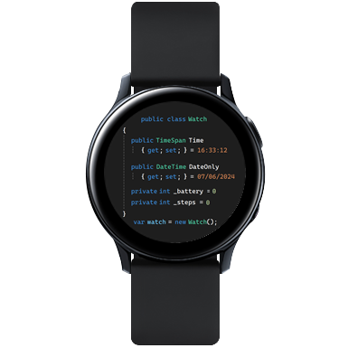
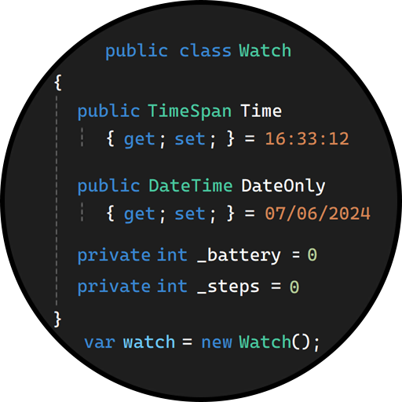

<h1 align="center">
    
     
    SourceCode watchface for Tizen
     
</h1>

This is a simple watchface for Tizen operating system (tested on Samsung Galaxy Watch Active 2 with Tizen 5.5.0.2). Watchface is styled as C# source code with Visual Studio default color scheme. It displays current time, date, battery level and steps count.

## Preview

 
 

## Installation
Because GalaxyWatchStudio is no longer supported by Samsung, installation is a bit tricky. Steps to install this watchface (vscoding.gwd) are in [this forum post](https://forum.developer.samsung.com/t/getting-samsung-distributor-certificate/27222/82).
